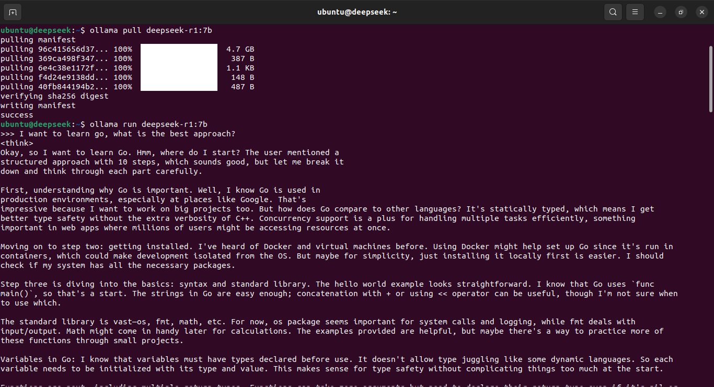

# Server Requirements

- **Disk**: 16GB
- **CPU**: 4 Cores
- **Memory**: 16GB
- **Swap**: 8GB

## Install curl

```sh
sudo apt install curl
```

## Install Ollama

```sh
curl -fsSL https://ollama.com/install.sh | sh
```

## Verify Installation

```sh
ollama --version
systemctl is-active ollama.service
```

## Download DeepSeek-R1

```sh
ollama pull deepseek-r1:7b
```

## Begin to Use DeepSeek

```sh
ollama run deepseek-r1:7b
```

This is how it should prompt:

