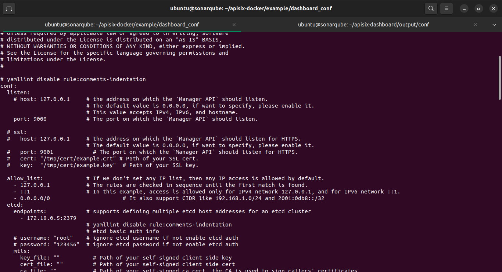
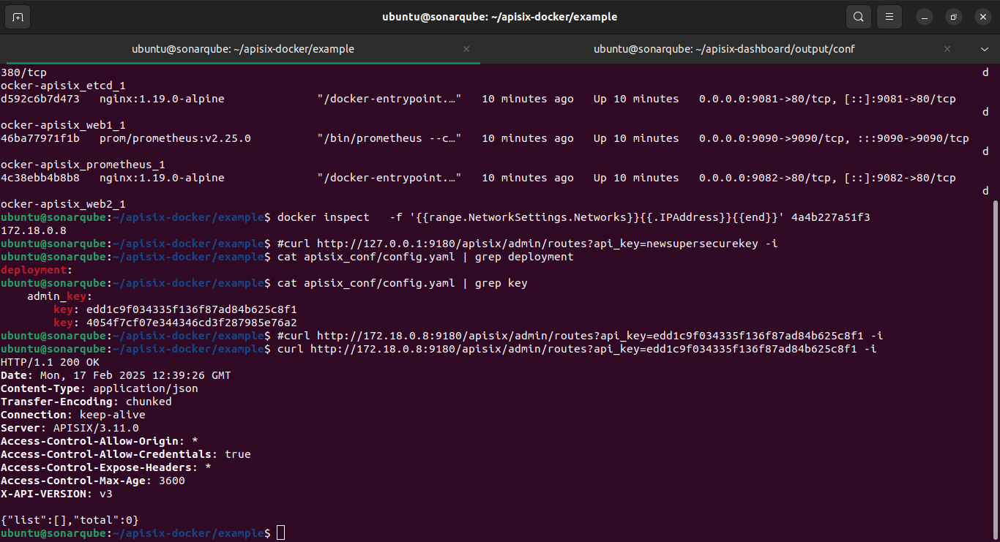

# ALL IN ONE DOCKER INSTALLATION

### First clone the apisix-docker repository:

```sh
git clone https://github.com/apache/apisix-docker.git
cd apisix-docker/example
```

### Use docker-compose to start APISIX, Grafana, Prometheus, APISIX-Dashboard, Nginx

```sh
docker-compose -p docker-apisix up -d
```

#### Edit apisix-dashboard config file


#### Get container ip
```sh
docker inspect \
>   -f '{{range.NetworkSettings.Networks}}{{.IPAddress}}{{end}}' etcd container id
```

```yaml
etcd:
    endpoints:            # supports defining multiple etcd host addresses for an etcd cluster
      - 172.18.0.5:2379  # ETCD Container IP
```



#### Update compose file

```yaml
  etcd:
    image: bitnami/etcd:3.5.11
    restart: always
    volumes:
      - etcd_data:/bitnami/etcd
    environment:
      ETCD_ENABLE_V2: "true"
      ALLOW_NONE_AUTHENTICATION: "yes"
      #ETCD_ADVERTISE_CLIENT_URLS: "http://etcd:2379" replace with below
      ETCD_ADVERTISE_CLIENT_URLS: "http://0.0.0.0:2379"
      ETCD_LISTEN_CLIENT_URLS: "http://0.0.0.0:2379"
    ports:
      - "2379:2379/tcp"
    networks:
      apisix:

  apisix-dashboard:
    image: apache/apisix-dashboard:latest
    restart: always
    volumes:
    # './dashboard_conf/conf.yaml` this is the path n the cloned repo
      - ./dashboard_conf/conf.yaml:/usr/local/apisix-dashboard/conf/conf.yaml:ro
    depends_on:
      - etcd
    ports:
      - "9000:9000/tcp"
    networks:
      apisix:

```