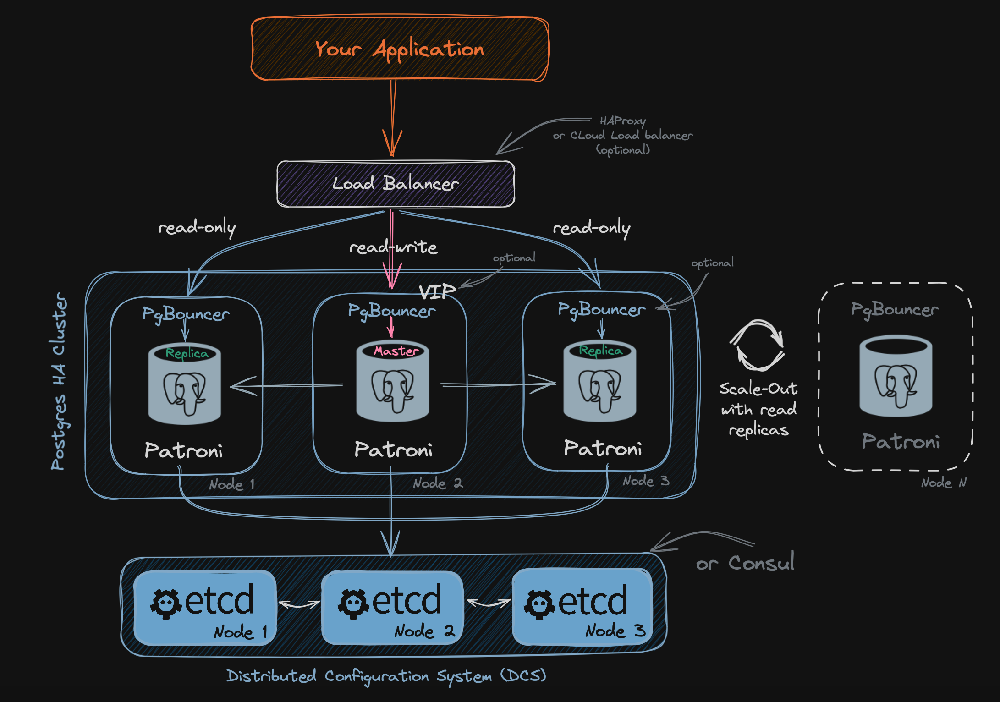
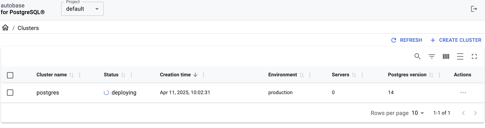

# AUTOBASE
Automated database platform for PostgreSQL® - Your own DBaaS. The open-source alternative to cloud-managed databases.


## Use Cases
Automated self-managed database - Autobase automates deployment, failover, backups, restores, upgrades, scaling, amd more, eliminating the need for manual database management.

## Pros
- Full control without vendor lock-In. Your database environment remains fully under your control because both the Autobase and the PostgreSQL clusters it deploys run on your own infrastructure
- Cost effective
- Easy to manage
- Data security. Built-in encryption, access management, and automated backups (PITR) ensure data security and compliance, protecting your database from leaks, unauthorized access, and data loss. Keep your data safe, recoverable, and always available.
- Scalability and performance. Designed for businesses of all sizes, Autobase seamlessly adapts to evolving requirements. Scale effortlessly with read replicas, ensuring high availability and optimal performance as your workload grows.
- Infrastructure as Code and GitOps
- Extensibility

## Cons
Supported Linux Distributions:
Debian: 11, 12
Ubuntu: 22.04, 24.04
CentOS Stream: 9
Oracle Linux: 8, 9
Rocky Linux: 8, 9
AlmaLinux: 8, 9

Cluster configuration done only through cli

NOTE
List of required TCP ports that must be open for the database cluster:

5432 (postgresql)
6432 (pgbouncer)
8008 (patroni rest api)
2379, 2380 (etcd)
for the scheme "PostgreSQL High-Availability with Load Balancing":

5000 (haproxy - (read/write) master)
5001 (haproxy - (read only) all replicas)
5002 (haproxy - (read only) synchronous replica only)
5003 (haproxy - (read only) asynchronous replicas only)
7000 (optional, haproxy stats)

## Postgres Cluster


## Installation

### Docker

```sh
docker run -d --name autobase-console \
  --publish 80:80 \
  --publish 8080:8080 \
  --env PG_CONSOLE_API_URL=http://192.168.84.54:8080/api/v1 \
  --env PG_CONSOLE_AUTHORIZATION_TOKEN=secret_token \
  --env PG_CONSOLE_DOCKER_IMAGE=autobase/automation:latest \
  --volume console_postgres:/var/lib/postgresql \
  --volume /var/run/docker.sock:/var/run/docker.sock \
  --volume /tmp/ansible:/tmp/ansible \
  --restart=unless-stopped \
  autobase/console:latest
```




### CLI

NOTE:
 - Correct installation of Python
 - Correct installation of Ansible-core

`sudo apt update && sudo apt install -y python3-pip sshpass git`

`pip3 install ansible / sudo pip3 install ansible`

`ansible-galaxy collection install vitabaks.autobase`

`git clone https://github.com/vitabaks/autobase.git`

`cd autobase/automation`

`ansible-galaxy install --force -r requirements.yml`

Edit the `inventory` file

Check validity  `ansible-inventory -i inventory.ini --list`

cd automation/roles/common/defaults/main.yml

Edit the variable file `vars/main.yml`

NOTE:

```yaml
Minimum set of variables:

- proxy_env to download packages in environments without direct internet access (optional)
- patroni_cluster_name
- postgresql_version
- postgresql_data_dir
- cluster_vip to provide a single entry point for client access to databases in the cluster (optional)
- with_haproxy_load_balancing to enable load balancing (optional)
- dcs_type "etcd" (default) or "consul"

```


pip3 install --upgrade ansible
pip install ansible-core
pip3 install ansible-core==2.18.4

`ansible-playbook deploy_pgcluster.yml`

ERROR
ERROR! couldn't resolve module/action 'ansible.builtin.deb822_repository'. This often indicates a misspelling, missing collection, or incorrect module path

SOLUTION
PYTHON version 3.10+
ansible-core version 2.15+

Upgrade python
sudo apt install software-properties-common -y
sudo apt update
sudo add-apt-repository ppa:deadsnakes/ppa
sudo apt update
sudo add-apt-repository ppa:deadsnakes/ppa -y
sudo apt update
apt list | grep python3.13
sudo apt install python3.13
python3.13 --version

sudo add-apt-repository ppa:deadsnakes/ppa -y
sudo apt update
sudo apt install python3.10 python3.10-venv python3.10-distutils -y


echo "alias py=/usr/bin/python3.13" >> ~/.bashrc
echo "alias python=/usr/bin/python3.13" >> ~/.bashrc


python3.10 -m venv ansible-env

source ansible-env/bin/activate

pip install --upgrade pip

pip install ansible-core==2.17


```sh
sudo apt install ansible-lint 

alias python='/usr/bin/python3.10'

python -m pip install --upgrade --user ansible

ansible --version
```

### Install python
sudo apt update
sudo apt install -y software-properties-common

sudo add-apt-repository ppa:deadsnakes/ppa
sudo apt update
sudo apt install -y python3.10 python3.10-venv python3.10-distutils

sudo ln -sf /usr/bin/python3.10 /usr/bin/python3
python3 --version

### Install pip for v3.13
wget https://bootstrap.pypa.io/get-pip.py
python3.13 get-pip.py --user
python3.13 -m pip --version

### Install ansible
rm -f ~/.local/bin/ansible ~/.local/bin/ansible-playbook
s
python3.10 -m pip install --force-reinstall --user ansible

python -m pip install --upgrade --user ansible


Make sure its

```yaml
ansible [core 2.17.10]
  config file = /home/ubuntu/autobase/automation/ansible.cfg
  configured module search path = ['/home/ubuntu/.ansible/plugins/modules', '/usr/share/ansible/plugins/modules']
  ansible python module location = /home/ubuntu/.local/lib/python3.10/site-packages/ansible
  ansible collection location = /home/ubuntu/.ansible/collections:/usr/share/ansible/collections
  executable location = /home/ubuntu/.local/bin/ansible
  python version = 3.10.16 (main, Dec  4 2024, 08:53:37) [GCC 9.4.0] (/usr/bin/python3.10)
  jinja version = 3.1.6
  libyaml = False
```

CONTINUE...

ansible-galaxy install --force -r requirements.yml

`ansible all -m ping`

Edit inventory file

edit vars/main.yml

sudo patronictl -c /etc/patroni.yml list ....check patroni cluster name

psql --version

ansible-playbook config_pgcluster.yml

ansible-playbook deploy_pgcluster.yml


ERRORS: 

`Traceback (most recent call last):
  File "/usr/local/bin/patronictl", line 5, in <module>
    from patroni.ctl import ctl
ModuleNotFoundError: No module named 'patroni'`

PatroniFatalException: Can not find suitable configuration of distributed configuration store
curl http://192.168.84.53:2379/health
curl: (7) Failed to connect to 192.168.84.53 port 2379 after 0 ms: Connection refused


solution:  `sudo pip3 install patroni` 

python3.10 -m pip install patroni

sudo nano /etc/default/etcd
ETCD_LISTEN_CLIENT_URLS="http://0.0.0.0:2379"
ETCD_ADVERTISE_CLIENT_URLS="http://192.168.84.53:2379"
sudo systemctl daemon-reexec
sudo systemctl restart etcd

sudo pip3 install etcd3 ...with and without sudo
sudo pip install python-etcd....with and without sudo


....

update /roles/common/default/main.yaml

`patroni_superuser_username:`
`postgres_username:`
`postgres_password:`


### Change psql user password

sudo nano /etc/postgresql/14/main/pg_hba.conf 

change `host    all             all             127.0.0.1/32            trust`
sudo systemctl restart postgresql
psql -h 127.0.0.1 -U postgres -d postgres
sudo nano /etc/postgresql/14/main/pg_hba.conf 
sudo systemctl restart postgresql
psql -h 127.0.0.1 -U postgres -d postgres


COMMANDS

patronictl list


UPGRADE UBUNTU

`sudo apt update`

`sudo apt upgrade`

`lsb_release -a`

`sudo do-release-upgrade`

`sudo reboot`

`lsb_release -a`


    users:
        admin:
          password: admin
            options:
                - createrole
                - createdb


/etc/pam.d/sudo

sudo nano /etc/systemd/system/patroni.service