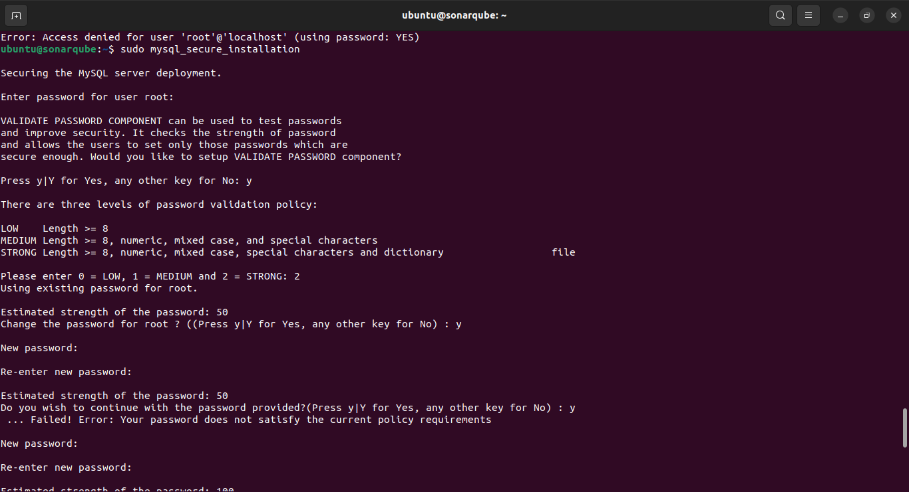
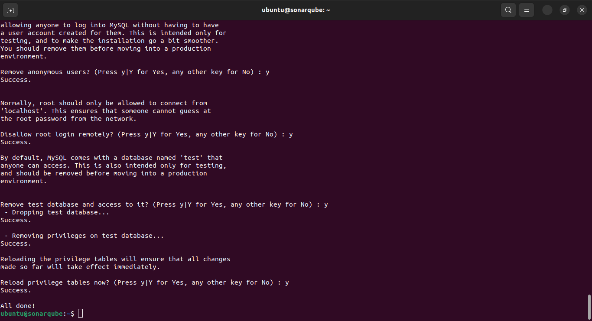
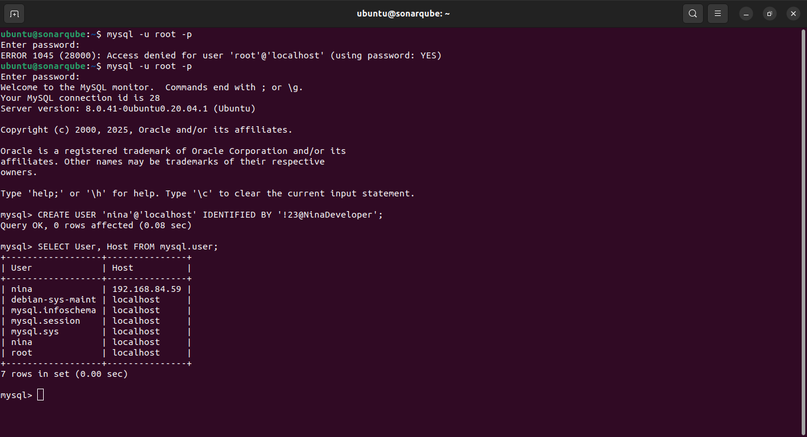
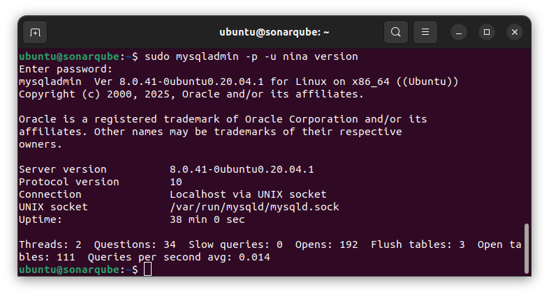
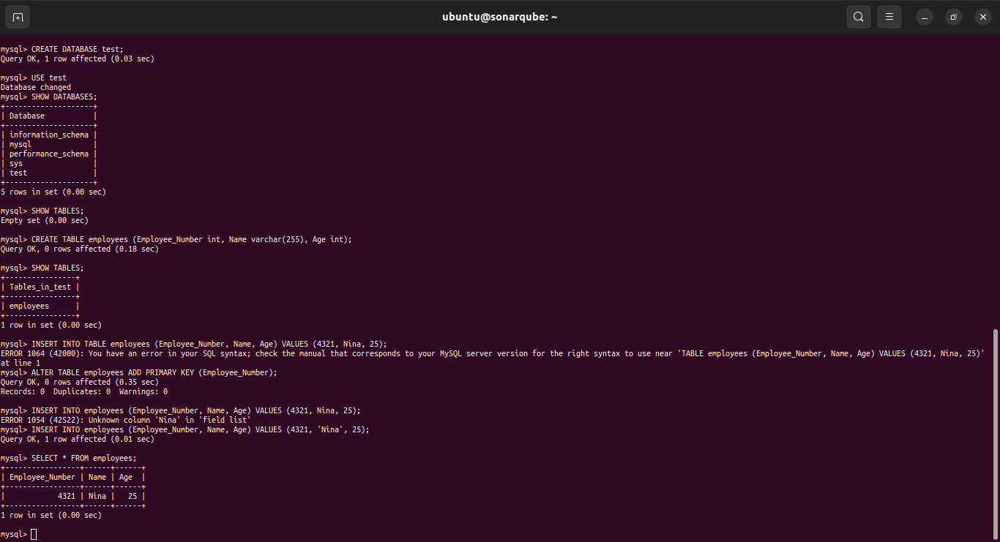

# DATABASES (Relational & Non-Relational)

## PostgreSQL

`sudo apt update`

`sudo apt install postgresql postgresql-contrib`

`sudo systemctl start postgresql.service`

`sudo -i -u postgres ----> psql or sudo -u postgres psql`

### Create role

`sudo -u postgres createuser --interactive`

`sudo -u postgres createdb db_name`

`sudo adduser username`

`sudo -i -u user ----> psql -d db_name`

## MYSQL

`sudo apt update`

`sudo apt install mysql-server`

`sudo systemctl start mysql.service`

`sudo mysql`

`ALTER USER 'root'@'localhost' IDENTIFIED WITH mysql_native_password BY 'password';`

`mysql > ` ` exit`

### Perform secure Installation

`sudo mysql_secure_installation`





`mysql -u root -p`

`mysql >` `CREATE USER 'username'@'host' IDENTIFIED WITH authentication_plugin BY 'password';`

`mysql >` `CREATE USER 'username'@'localhost' IDENTIFIED BY 'password';`

#### NOTE: Make sure to use localhost



`GRANT CREATE, ALTER, DROP, INSERT, UPDATE, INDEX, DELETE, SELECT, REFERENCES, RELOAD on _._ TO 'sammy'@'localhost' WITH GRANT OPTION;`

`FLUSH PRIVILEGES;`

`exit`

`mysql -u sammy -p`

`sudo mysqladmin -p -u sammy version`





`mysql> SELECT \* FROM test.employees INTO OUTFILE '/var/lib/mysql-files/employeelist.csv';`

## Casandra

### Check java version

`$ java -version`

```yaml
echo "deb [signed-by=/etc/apt/keyrings/apache-cassandra.asc] https://debian.cassandra.apache.org 50x main" | sudo tee -a /etc/apt/sources.list.d/cassandra.sources.list
deb https://debian.cassandra.apache.org 50x main
```

`curl -o /etc/apt/keyrings/apache-cassandra.asc https://downloads.apache.org/cassandra/KEYS`

`sudo apt-get update`

`sudo apt-get install cassandra`

`nodetool status`

### Connect to database

`cqlsh`

### Create casandra service

```yaml
[cassandra]
name=Apache Cassandra
baseurl=https://redhat.cassandra.apache.org/42x/
gpgcheck=1
repo_gpgcheck=1
gpgkey=https://downloads.apache.org/cassandra/KEYS
```
