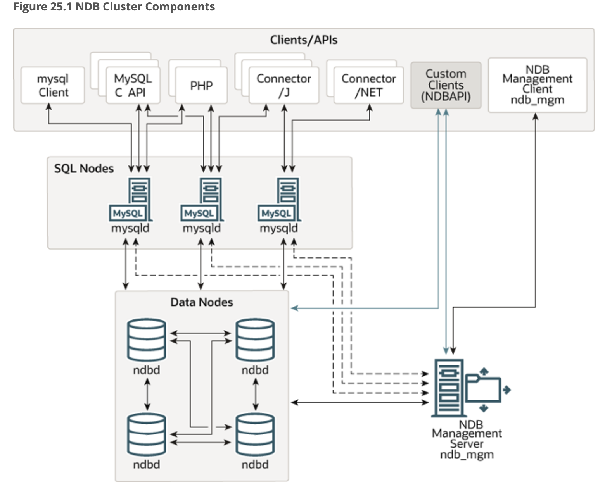
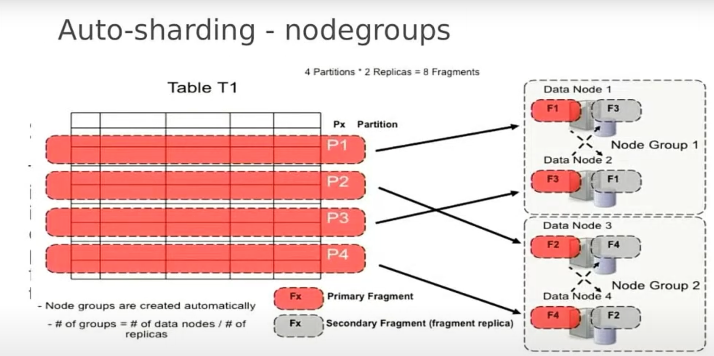

# MySQL NDB Cluster Documentation

## Overview

MySQL NDB Cluster combines the MySQL Server with the NDB Storage Engine to provide a high-performance, distributed database solution. It supports both in-memory and disk-based data storage.

### Key Features
- **Auto Partitioning**: Automatic distribution of data across nodes.
- **Data Distribution**: Ensures data is evenly distributed.
- **Replication**: Synchronous replication for high availability.
- **Masterless Architecture**: No single point of failure.
- **Shared Nothing**: Each node has its own memory and disk.
- **Transactional Consistency**: ACID-compliant transactions.
- **SQL and NoSQL Support**: Access data using SQL or NoSQL APIs.
- **Scalability**: Supports up to 40 data nodes and 200 MySQL servers.
- **High Performance**: 200M reads/sec, 1B updates/minute.
- **High Availability**: 99.9999% uptime (30 seconds downtime per year).
- **Auto-Sharding**: Transparent sharding for horizontal scaling.

- **Cluster Online Operations**: Perform reconfigurations without downtime.
- **Self-Healing**: Automatic recovery from node failures.

---

## Notes

### Consensus
- MySQL NDB Cluster uses **XCom**, a Paxos-based consensus algorithm, to ensure data consistency and reliability.
- A quorum is required for consensus, typically a majority of nodes (e.g., 3 out of 4 nodes or 4 out of 6 nodes).

### In-Memory Storage
- Primary storage is in memory for fast read and write access.

### Disk-Backend Tablespaces
- Non-indexed data can be stored on disk using tablespaces.

### Persisting Data
- Data is persisted through checkpoints to ensure integrity during restarts or failures.

### Disk Data Objects
- Disk storage uses tablespaces, data files, and undo log file groups.

### Restart and Recovery
- During a restart, data is reloaded from disk-backed tablespaces to maintain consistency.

**Note**: MySQL NDB Cluster is designed to avoid single points of failure. Shared storage mechanisms like network shares, NFS, or SANs are not recommended.

---

## MySQL NDB Cluster: Scalability

- **Auto-Sharding**: Automatically partitions tables across nodes for horizontal scaling.
- **Transparent Sharding**: Applications can connect to any node, and queries automatically access the correct shards.
- **Active/Active Multi-Master Architecture**: Updates can be handled by any node and are instantly available across the cluster.
- **JOIN Operations**: Supports JOINs, ACID guarantees, and referential integrity across shards.
- **Geographical Replication**: Replicates across data centers for disaster recovery and global scalability.
- **Conflict Handling**: Ensures consistency across locations during updates.

---

## High Availability

MySQL NDB Cluster is designed for 99.999% availability with features to protect against outages and minimize downtime.

### Outage Protection
- **Synchronous Replication**: Data is synchronously replicated between data nodes.
- **Automatic Failover**: Heartbeating mechanism detects failures and fails over within one second.
- **Self-Healing**: Failed nodes automatically restart, resynchronize, and rejoin the cluster.
- **Shared Nothing Architecture**: Eliminates risks from shared components like storage.
- **Geographical Replication**: Mirrors nodes to remote data centers for disaster recovery.

### Scheduled Maintenance
MySQL NDB Cluster supports online operations to minimize downtime:
- Online schema updates.
- Online scaling (adding nodes for capacity and performance).
- Online upgrades and patching of hosts, OS, and database.
- Online backups.

