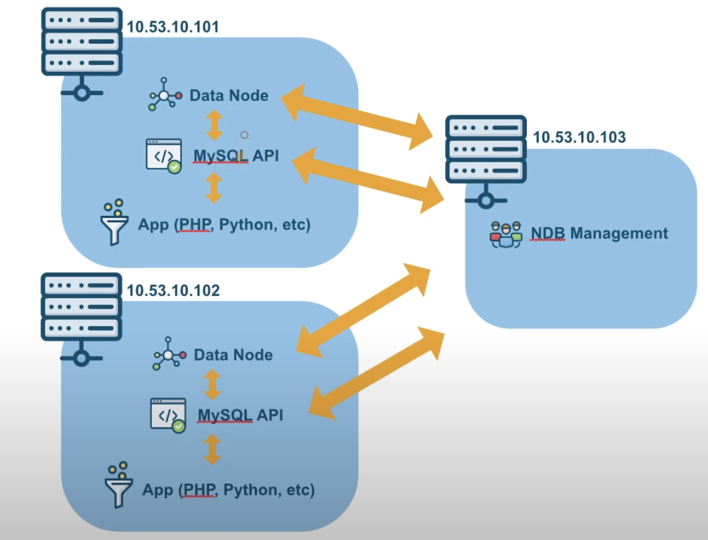

# MYSQL NDB CLUSTER
MySQL NDB Cluster is the distributed database combining linear scalability and high availability. It provides in-memory real-time access with transactional consistency across partitioned and distributed datasets. It is designed for mission critical applications.

https://dev.mysql.com/downloads/cluster/


## Architecture



## Installation

### MYSQL Server 1 and 2

`sudo apt install libclass-methodmaker-perl`

`sudo apt install baio1 libmecab2`

mysql-cluster-community-data-node

`wget https://dev.mysql.com/get/Downloads/MySQL-Cluster-9.3/mysql-cluster-community-data-node_9.3.0-1ubuntu22.04_amd64.deb`

mysql-common

`wget https://dev.mysql.com/get/Downloads/MySQL-Cluster-9.3/mysql-common_9.3.0-1ubuntu22.04_amd64.deb`

mysql-cluster-community-client-core

`wget https://dev.mysql.com/get/Downloads/MySQL-Cluster-9.3/mysql-cluster-community-client-core_9.3.0-1ubuntu22.04_amd64.deb`

mysql-cluster-community-client

`wget https://dev.mysql.com/get/Downloads/MySQL-Cluster-9.3/mysql-cluster-community-client_9.3.0-1ubuntu22.04_amd64.deb`

mysql-client

`wget https://dev.mysql.com/get/Downloads/MySQL-Cluster-9.3/mysql-client_9.3.0-1ubuntu22.04_amd64.deb `

mysql-cluster-community-server-core

`wget https://dev.mysql.com/get/Downloads/MySQL-Cluster-9.3/mysql-cluster-community-server-core_9.3.0-1ubuntu22.04_amd64.deb`

mysql-cluster-community-server

`wget https://dev.mysql.com/get/Downloads/MySQL-Cluster-9.3/mysql-cluster-community-server_9.3.0-1ubuntu22.04_amd64.deb`

mysql-server

`wget https://dev.mysql.com/get/Downloads/MySQL-Cluster-9.3/mysql-server_9.3.0-1ubuntu22.04_amd64.deb`

Install 

`sudo dpkg -i *.deb`

`sudo nano /etc/my.cnf`

```yaml
[mysql_cluster]
ndb-connectstring=ndb_server_ip
```

`mkdir -p /usr/local/mysql/data`

`sudo nano /etc/systemd/system/ndbd.service`

```yaml
[Unit]
Description=MySQL NDB Data Node Daemon 
After=network.target auditd.service

[Service]
Type=forking
ExecStart=/usr/sbin/ndbd 
ExecReload=/bin/kill -HUP $MAINPID
KillMode=process 
Restart=on-failure

[Install]
WantedBy=multi-user.target
```

`sudo systemctl enable ndbd`

`sudo systemctl daemon-reload`

MYSQL Config

`sudo nano /etc/mysql/my.cnf`

```yaml
[mysqld]
ndbcluster 
ndb-connectstring=ndb_server_ip
[mysql_cluster] 
ndb-connectstring=ndb_server_ip
```

`sudo service mysql restart`

`ndbd`

`ndb_mgm -e show`

`mysql -u root -p`


> create table test (name varchar(50) not null default '') ENGINE=NDBCLUSTER;

### NDB Management server

mysql-cluster-community-management-server

`wget https://dev.mysql.com/get/Downloads/MySQL-Cluster-9.3/mysql-cluster-community-management-server_9.3.0-1ubuntu22.04_amd64.deb`

Install 

`sudo dpkg -i mysql-cluster-community-management-server_9.3.0-1ubuntu22.04_amd64.deb`

Configuration

`mkdir -p /usr/mysql-cluster`

`sudo nano /usr/mysql-cluster/config.ini`

```yaml
[ndbd default]
NoOfReplicas=2

[ndb_mgmd]
hostname=private_ip_ndb_mgmd 
datadir=/usr/mysql-cluster
NodeId=1

[ndbd]
hostname=private_ip_node1
NodeId=11
datadir=/usr/local/mysql/data

[ndbd]
hostname=private_ip_node2
NodeId=12
datadir=/usr/local/mysql/data

[mysqld]
hostname=private_ip_node1
NodeId=21

[mysqld]
hostname=private_ip_node2
NodeId=22
```

`sudo nano /etc/systemd/system/ndb_mgmd.service`

```yaml
[Unit]
Description=MySQL NDB Cluster Management Server 
After=network.target auditd.service

[Service]
Type=forking
ExecStart=/usr/sbin/ndb_mgmd -f /usr/mysql-cluster/config.ini 
ExecReload=/bin/kill -HUP $MAINPID 
KillMode=process
Restart=on-failure

[Install]
WantedBy=multi-user.target
```
`sudo systemctl enable ndb_mgmd`

`sudo systemctl daemon-reload`

`sudo ndb_mgmd --initial --config-file=/usr/mysql-cluster/config.ini`


Commands:

`sudo pkill ndb_mgmd`

`sudo pkill ndb`

`ndb_mgm-e show` - List all Clusters

`ndbd`-Start the node

`pkill ndbd`-End process the nodes

`pkill ndb mgmd`-End process the NDB management