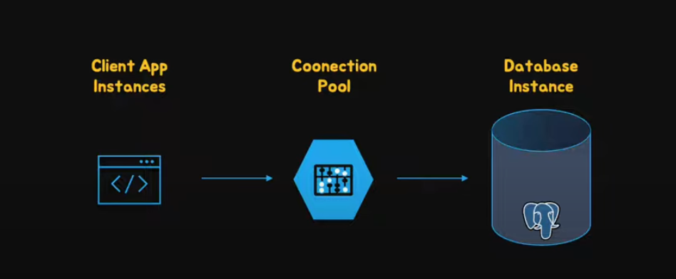
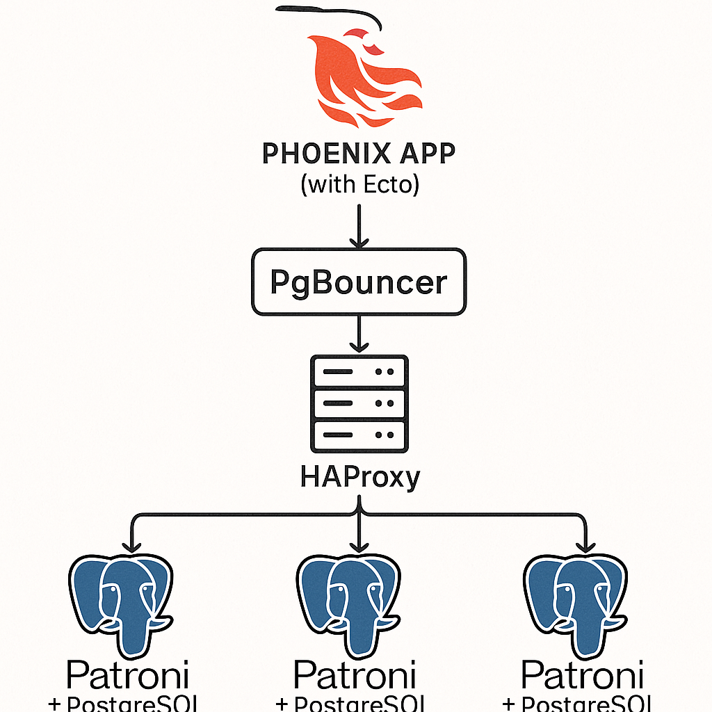

# PGBOUNCER

Acts as a proxy

## Pgbouncer configuration

`/etc/pgbouncer/pgbouncer.ini`

Parameters 
- Min pool size: Minimum number of server connections to keep ins a pool(reasonably sized to sustain high connections)
- Default pool size : Maximum clients you want to handle at any moment
- Max client conn: Total number of cients that can connect

Performance analysis

- Connection time
- Query time
- Persistent connection (Keeping connection open and performing a query)

Online PgBouncer Restart

`pgbouncer -R /etc/pgbouncer/pgbouncer.ini`

## Connection Pooling

Pool Modes
- Session....until client disconnects
- Transaction....until transaction is completed
- Statement...return connection to pool immediately at the end of the statement

PGBENCH - Pgbench is a postgresql tool that allows us to perform benchmark tests on PostgreSQL database. It allows us to perform stress tests

`pgbench -i postgres`

`pgbench -c 20 -t 1000 -S postgres -C -f /tmp/test_db/select.sql -p 5432`

    20 clients  1000 transactions                         
    -C close open conn and create new conn 

## Connection Queuing

Connections from clients are usually unlimited. You can incorporate max conn but what happens to the client when max conn is reached?

Good practice is to limit number of connections
- Default pool size : Maximum clients you want to handle at any moment

When max conn is reached others wait

`psql -p 64312 pgbouncer`
    
    SHOW pools;

    pgbouncer database- shows stats(cl_active, cl_waiting, maxwait)

## Connection Routing

