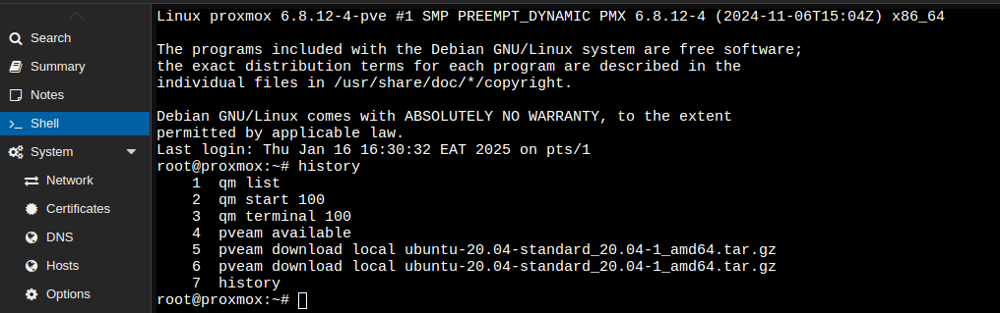
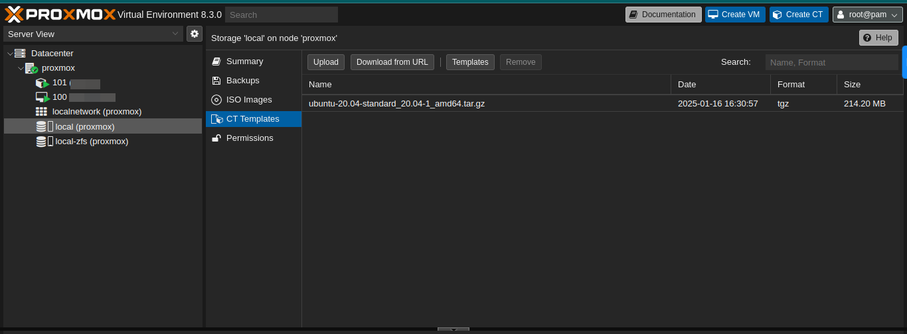

# Proxmox LXC Creation

## Steps

1. **Log into Proxmox Shell**

   - Access the Proxmox shell interface.
     

2. **List Available ISO Images**

   - Run the command `pveam available` to see a list of available ISO images.

3. **Copy the ISO Image Name**

   - Identify and copy the desired ISO image name from the list.

4. **Download the ISO Image**

   - Execute the command to download the zipped file for the ISO:
     ```sh
     pveam download local ubuntu-20.04-standard_20.04-1_amd64.tar.gz
     ```

5. **View the Downloaded ISO**

   - Confirm the ISO image has been downloaded.
     

6. **Create an LXC Container**

   - Follow the provided screenshot steps to create an LXC container.

7. **Log in to the VM**

   - Access the newly created virtual machine.

8. **Perform Server Hardening**
   - Enhance the security of the Ubuntu server by following these steps:

### Installation of Required Packages

Install multiple packages and tools using the apt package manager:

```sh
sudo apt -y install unzip git curl node-gyp xsltproc libxml2-utils fop gcc g++ make build-essential automake autoconf wget tmux autotools-dev software-properties-common net-tools libncurses5-dev npm wkhtmltopdf xfonts-75dpi nodejs libnode-dev xvfb acct fail2ban
```

This command installs multiple packages and tools using the apt package manager with the -y flag (auto-confirmation). Below is a breakdown of the tools:

- **unzip**: Extract .zip files.
- **git**: Version control tool.
- **curl**: Transfer data from or to a server using protocols like HTTP, HTTPS.
- **node-gyp**: Tool for compiling Node.js native add-ons.
- **xsltproc**: XSLT processor to transform XML files using XSLT.
- **libxml2-utils**: Tools for working with XML, such as validation and parsing.
- **fop**: XML to PDF converter.
- **gcc, g++**: GNU compilers for C and C++.
- **make, build-essential**: Build automation and essential tools for compiling software.
- **automake, autoconf**: Tools to create configuration files for building software.
- **wget**: Command-line utility to download files.
- **tmux**: Terminal multiplexer for managing multiple terminal sessions.
- **autotools-dev**: Auxiliary tools for software configuration.
- **software-properties-common**: Manages software repositories and properties.
- **net-tools**: Provides networking tools like ifconfig.
- **libncurses5-dev**: Development library for terminal user interfaces.
- **npm**: Node.js package manager.
- **wkhtmltopdf**: Converts HTML to PDF.
- **xfonts-75dpi**: X fonts at 75 dots per inch.
- **nodejs**: JavaScript runtime environment.
- **libnode-dev**: Development files for Node.js.
- **xvfb**: Virtual framebuffer for running graphical applications headlessly.
- **acct**: Utilities for monitoring user activity and process accounting.
- **fail2ban**: Intrusion prevention software that scans log files and bans IPs showing malicious behavior.

### Configuring SSH Server

These commands modify the SSH server configuration file (/etc/ssh/sshd_config) to enhance security and customize SSH behavior. Each command uses sed (stream editor) to search and replace specific lines in the configuration file.

#### Disable Root Login

```sh
sudo sed -i 's/#PermitRootLogin prohibit-password/PermitRootLogin no/g' /etc/ssh/sshd_config
```

Disables root login over SSH by setting PermitRootLogin to no.

#### Enable Public Key Authentication

```sh
sudo sed -i 's/#PubkeyAuthentication yes/PubkeyAuthentication yes/g' /etc/ssh/sshd_config
```

Ensures that public key authentication is enabled for SSH.

#### Enable Authorized Keys File

```sh
sudo sed -i 's/#AuthorizedKeysFile/AuthorizedKeysFile/g' /etc/ssh/sshd_config
```

Ensures the AuthorizedKeysFile directive is active, defining where public keys are stored for authentication.

#### Disable Password Authentication

```sh
sudo sed -i 's/PasswordAuthentication yes/PasswordAuthentication no/g' /etc/ssh/sshd_config
```

Disables password-based SSH login, requiring public key authentication instead.

#### Set Login Banner

```sh
sudo sed -i 's+#Banner none+Banner /etc/ssh/loginbanner+g' /etc/ssh/sshd_config
```

Configures an SSH login banner by pointing to the /etc/ssh/loginbanner file. This file typically contains a warning or information displayed upon login.

#### Bind SSH to Listen on a Specific Address

```sh
sudo sed -i 's+#ListenAddress 0.0.0.0+ListenAddress 0.0.0.0+g' /etc/ssh/sshd_config
```

Ensures the ListenAddress directive is active and binds the SSH server to all network interfaces (0.0.0.0).

### Create New System User

```sh
adduser ubuntu
sudo cat /etc/passwd
usermod -aG sudo ubuntu
```

### Configure fail2ban

```sh
systemctl status fail2ban.service
cp jail.conf jail.local
```

Edit the `jail.local` file and add the following content:

```yaml
[sshd]
port    = ssh
backend = %(sshd_backend)s
enabled = true
logpath = /var/log/auth.log
maxretry = 3
findtime = 600
bantime = 36600
```

Restart the fail2ban service:

```sh
systemctl start fail2ban.service
```

### Add SSH Banner

Edit `/etc/ssh/sshd_config` to add the banner path:

```sh
Banner /etc/ssh/mybanner
```

Create the banner file `/etc/ssh/mybanner` with the following content:

```yaml
This computer system is for authorized users only. Individuals using this
system without authority or in excess of their authority are subject to
having all their activities on this system monitored and recorded or
examined by any authorized person, including law enforcement, as system
personnel deem appropriate.

Any material so recorded may be disclosed as appropriate.

Anyone using this system consents to these terms.
```

### Edit sudoers File

Edit the sudoers file to log sudo commands and allow passwordless login for the ubuntu user.

### Final Note

The server is ready for use. Optionally, you can clone and create a template from the LXC container for future server creation.

### Workaround for sudo ls Issue

If you encounter the following issue:

```sh
sudo: setrlimit(RLIMIT_CORE): Operation not permitted
```

Use this workaround:

```sh
echo "Set disable_coredump false" >> /etc/sudo.conf
```
